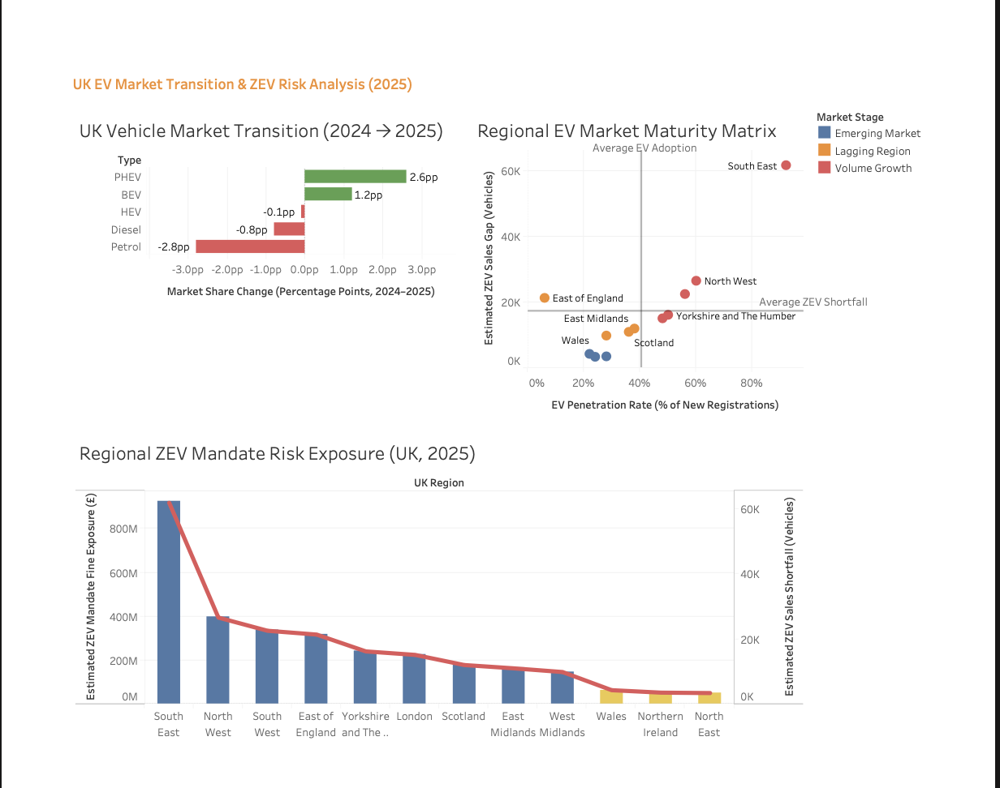

# UK EV Market Transition & ZEV Mandate Risk Analysis (2025)

This project analyses the UK electric vehicle (EV) market transition and evaluates regional risk under the Zero Emission Vehicle (ZEV) mandate.

Using real vehicle registration data, the project estimates EV adoption gaps, potential financial penalties, and regional market maturity across the UK.

---

## 📊 Key Insights

- Petrol and diesel vehicles show a clear decline, while BEV and PHEV adoption is increasing, indicating a strong transition toward electrification

- Regions such as the South East and North West have high EV penetration but still face large ZEV compliance gaps, suggesting demand growth alone is not sufficient to meet policy targets

- Regions with low EV penetration and low shortfall (e.g. Wales, North East) are classified as emerging markets, indicating early-stage adoption with lower immediate policy risk

- Estimated ZEV non-compliance could result in substantial financial exposure, with some regions facing hundreds of millions in potential penalties

  ---

## 🏗️ Project Workflow

Raw Data → Power Query Cleaning → SQL Analysis → CSV Outputs → Tableau Dashboard

---

## 🧹 Data Cleaning (Green Table)

Raw datasets (e.g. VEH172, VEH104) were cleaned using Power Query in Excel before SQL analysis.

Key cleaning steps:

- Removed aggregated rows (e.g. England total) to avoid double counting  
- Standardised region names across datasets  
- Converted percentage values into numeric format for analysis  
- Filtered relevant years (2024–2025)  
- Restructured data into a consistent tabular format  

Cleaned dataset used for SQL:

`data/cleaned/ev_green_table.csv`
### 🔍 Sample Structure (Green Table)

| Region       | Year | New EVs | Penetration Rate |
|-------------|------|--------|------------------|
| South East  | 2025 | 12000  | 0.45             |
| North West  | 2025 | 8000   | 0.38             |
| Wales       | 2025 | 1500   | 0.22             |

---

## 🧮 SQL Analysis

The analysis was performed using SQL to transform the cleaned dataset into meaningful insights.

Key steps:

- Created a view to model realistic ZEV targets based on policy assumptions  
- Calculated EV adoption shortfall for each region  
- Estimated financial exposure using £15,000 per vehicle shortfall  
- Classified regions into risk categories (CRITICAL, HIGH, MODERATE)  
- Segmented regions into market maturity stages based on EV penetration and shortfall  

Main SQL script:
`sql/analysis.sql`
### 🔍 Example Query (ZEV Shortfall Calculation)

```sql
SELECT 
    region,
    new_evs,
    ROUND((new_evs / 0.20) * 0.28, 0) AS zev_target,
    ROUND(((new_evs / 0.20) * 0.28) - new_evs, 0) AS shortfall
FROM ev_fleet_analysis
WHERE year = 2025;
```
### 📊 Sample Output

| Region       | New EVs | ZEV Target | Shortfall |
|-------------|--------|-----------|----------|
| South East  | 12000  | 16800     | 4800     |
| North West  | 8000   | 11200     | 3200     |
| Wales       | 1500   | 2100      | 600      |

## 📊 Tableau Dashboard


This dashboard analyses UK EV adoption and ZEV mandate risk across regions, highlighting:

- EV penetration vs ZEV compliance gap
- Regional market maturity classification
- Estimated financial exposure from ZEV shortfall
- Market share shifts between ICE and EV vehicles (2024–2025)
